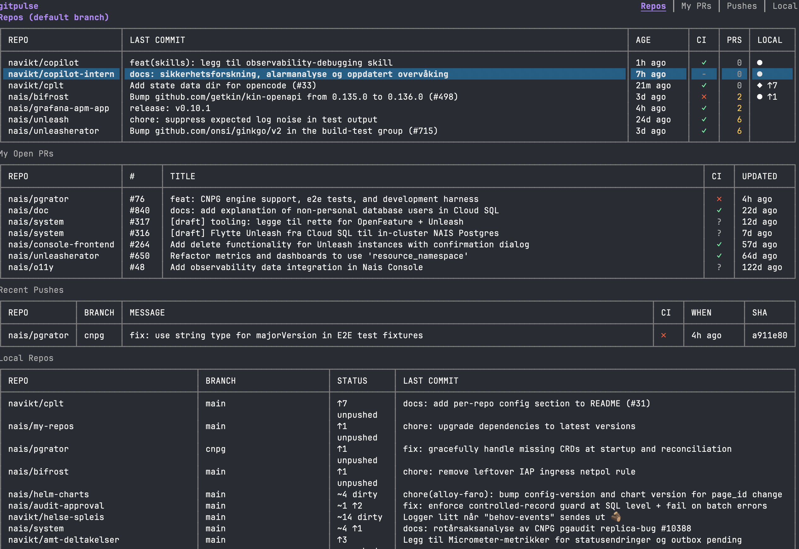

# gitpulse

A terminal dashboard for monitoring your GitHub repos across multiple orgs.



## Features

- **Repo health** — Last commit, CI status, open PRs for your configured repos
- **My open PRs** — All your open pull requests across orgs with CI status
- **Recent pushes** — Your recent push activity with commit messages and CI
- **Local status** — Scans local directories for dirty/unpushed repos, sorted by recency
- **Agent detection** — Shows active Copilot/cplt sessions per repo
- **Navigation** — j/k to select, Enter to expand, o to open in browser, e for editor
- **Visual alerts** — Bell on new CI failures
- **Caching** — File-based cache for fast startup, auto-refresh in background

## Install

```sh
go install github.com/nais/gitpulse@latest
```

Or build from source:

```sh
go build -o gitpulse .
```

## Configuration

Copy the example config and edit it:

```sh
cp config.toml.example config.toml
```

Or place it at `~/.config/gitpulse/config.toml`.

```toml
username = "your-github-username"
orgs = ["your-org"]

repos = [
  "your-org/repo-one",
  "your-org/repo-two",
]

local_dirs = [
  "~/src/github.com/your-org",
]
```

## Usage

```sh
# Run the TUI dashboard
gitpulse

# JSON output (for scripting)
gitpulse --json
```

### Keybindings

| Key | Action |
|-----|--------|
| `j/k` | Navigate rows (crosses tables in overview) |
| `J/K` | Switch panel focus |
| `Enter` | Expand/collapse focused panel |
| `o` | Open in browser |
| `e` | Open in editor |
| `g` | Open with `gh repo view --web` |
| `r` | Force refresh |
| `q` | Quit |

## Requirements

- Go 1.23+
- `gh` CLI (for authentication — uses `gh auth token`)
- Git (for local repo scanning)

## License

MIT
